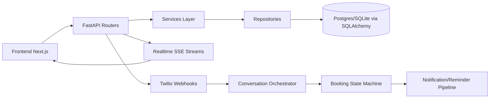

# KNOWLEDGE_GRAPH

Purpose: Fast bug-triage map for the Alysha Booking Assistant project.
Last updated: 2026-04-18

## 1) High-Level Graph

## 2) Backend Node Index

### Entry + wiring
- backend/app/main.py
  - App lifecycle, default seed worker/users, router registration

### API Routers
- backend/app/api/routers/auth.py
  - Login/refresh/logout/me
- backend/app/api/routers/ui.py
  - Effective section permissions for current user
- backend/app/api/routers/admin.py
  - Admin bookings, timeline, sessions, notifications, agent pause/resume, worker permissions
- backend/app/api/routers/worker.py
  - Worker upcoming bookings, approve/reject/complete, availability commands, messages
- backend/app/api/routers/events.py
  - Admin/worker SSE streams
- backend/app/api/routers/twilio.py
  - SMS/WhatsApp webhook intake
- backend/app/api/routers/agent.py
  - Agent processing/send-message endpoints
- backend/app/api/routers/media.py
  - Media ingest + admin media actions
- backend/app/api/routers/notifications.py
  - Dispatch/reminders run endpoints
- backend/app/api/routers/metrics.py
  - Metrics endpoint
- backend/app/api/routers/health.py
  - Health/readiness

### Services
- backend/app/services/conversation_orchestrator.py
  - Deterministic orchestration + assistant flow
- backend/app/services/booking_service.py
  - Booking lifecycle and transitions
- backend/app/services/availability_service.py
  - Slot checks and availability updates
- backend/app/services/auth_service.py
  - Password/JWT auth
- backend/app/services/permission_service.py
  - RBAC section enforcement
- backend/app/services/event_stream.py
  - Realtime event publication/stream behavior
- backend/app/services/notification_service.py
  - Notification queue/dispatch/reminder logic
- backend/app/services/twilio_gateway.py
  - Outbound Twilio send logic
- backend/app/services/media_service.py
  - Media/receipt workflows
- backend/app/services/worker_service.py
  - Worker portal command operations
- backend/app/services/agent_runtime.py
  - Assistant runtime integration

### Repositories
- backend/app/repositories/booking_repo.py
- backend/app/repositories/client_repo.py
- backend/app/repositories/message_repo.py
- backend/app/repositories/session_repo.py
- backend/app/repositories/notification_repo.py
- backend/app/repositories/idempotency_repo.py
- backend/app/repositories/user_repo.py
- backend/app/repositories/worker_repo.py
- backend/app/repositories/worker_permission_repo.py
- backend/app/repositories/audit_repo.py

### Models
- backend/app/models/booking.py
- backend/app/models/client.py
- backend/app/models/conversation_session.py
- backend/app/models/message.py
- backend/app/models/booking_media.py
- backend/app/models/notification.py
- backend/app/models/inbound_idempotency.py
- backend/app/models/user.py
- backend/app/models/worker.py
- backend/app/models/worker_section_permission.py
- backend/app/models/audit_event.py
- backend/app/models/enums.py

### Auth dependency guard
- backend/app/api/dependencies/auth.py
  - Role + permission checks used across guarded endpoints

### Migrations
- backend/alembic/versions/001_initial_schema.py
- backend/alembic/versions/002_phase5_reliability.py
- backend/alembic/versions/003_phase6_auth_rbac.py

## 3) Frontend Node Index

### App routes
- frontend/src/app/login/page.tsx
- frontend/src/app/(protected)/layout.tsx
- frontend/src/app/(protected)/dashboard/page.tsx
- frontend/src/app/(protected)/bookings/page.tsx
- frontend/src/app/(protected)/bookings/[id]/page.tsx
- frontend/src/app/(protected)/sessions/page.tsx
- frontend/src/app/(protected)/media/page.tsx
- frontend/src/app/(protected)/notifications/page.tsx
- frontend/src/app/(protected)/schedule/page.tsx
- frontend/src/app/(protected)/settings/page.tsx
- frontend/src/app/(protected)/worker/page.tsx

### Core auth + access control
- frontend/src/context/AuthContext.tsx
  - Session bootstrap, refresh, realtime hooks, section checks
- frontend/src/components/auth/AuthGuard.tsx
  - Protected route gate
- frontend/src/hooks/useAuth.ts
  - Auth helper exports

### API clients + realtime
- frontend/src/lib/api.ts
  - Token storage, 401 refresh/retry, API wrapper
- frontend/src/lib/adminApi.ts
  - Typed endpoint wrappers for admin/worker pages
- frontend/src/lib/realtime.ts
  - Authenticated SSE connection + reconnect behavior
- frontend/src/hooks/useAdminRealtimeRefresh.ts
  - Admin event listening/refresh trigger

### Navigation and visibility
- frontend/src/components/layout/Sidebar.tsx
  - Role-aware and section-aware menu visibility

## 4) Tests As Knowledge Graph Edges

- backend/tests/test_booking_state_machine.py
  - Booking transitions and invariants
- backend/tests/test_availability.py
  - Availability logic and slot behavior
- backend/tests/test_idempotency.py
  - Dedup and inbound idempotency protections
- backend/tests/test_phase2_orchestration.py
  - Orchestration contract behaviors
- backend/tests/test_phase3_lifecycle.py
  - Lifecycle/API progression scenarios
- backend/tests/test_phase5_reliability.py
  - Retry/dead-letter/reliability hardening
- backend/tests/test_phase6_auth_rbac.py
  - Role/permission enforcement and section restrictions
- backend/tests/test_phase6_track4_realtime.py
  - SSE/realtime propagation and update consistency
- backend/tests/test_health.py
  - Health/readiness

## 5) Bug Symptom -> First Files To Check

### Booking status or transition bug
1. backend/app/services/booking_service.py
2. backend/app/models/enums.py
3. backend/app/repositories/booking_repo.py
4. backend/tests/test_booking_state_machine.py
5. backend/tests/test_phase3_lifecycle.py

### Slot conflict or availability bug
1. backend/app/services/availability_service.py
2. backend/app/services/worker_service.py
3. backend/tests/test_availability.py

### Twilio intake or outbound messaging issue
1. backend/app/api/routers/twilio.py
2. backend/app/services/conversation_orchestrator.py
3. backend/app/services/twilio_gateway.py
4. backend/tests/test_phase2_orchestration.py
5. backend/tests/test_phase5_reliability.py

### Dedup/out-of-order/retry bug
1. backend/app/repositories/idempotency_repo.py
2. backend/app/services/notification_service.py
3. backend/app/models/inbound_idempotency.py
4. backend/tests/test_idempotency.py
5. backend/tests/test_phase5_reliability.py

### Auth or RBAC leak
1. backend/app/api/dependencies/auth.py
2. backend/app/services/auth_service.py
3. backend/app/services/permission_service.py
4. backend/app/api/routers/admin.py and backend/app/api/routers/worker.py
5. backend/tests/test_phase6_auth_rbac.py

### Admin/worker realtime sync issue
1. backend/app/services/event_stream.py
2. backend/app/api/routers/events.py
3. frontend/src/lib/realtime.ts
4. frontend/src/context/AuthContext.tsx
5. frontend/src/hooks/useAdminRealtimeRefresh.ts
6. backend/tests/test_phase6_track4_realtime.py

### Frontend route visibility or guard issue
1. frontend/src/context/AuthContext.tsx
2. frontend/src/components/auth/AuthGuard.tsx
3. frontend/src/components/layout/Sidebar.tsx
4. frontend/src/app/(protected)/layout.tsx
5. frontend/src/lib/adminApi.ts and frontend/src/lib/api.ts

### Dashboard fail-soft UX issue
1. frontend/src/app/(protected)/dashboard/page.tsx
2. frontend/src/lib/adminApi.ts
3. frontend/src/context/AuthContext.tsx

## 6) API Surface Snapshot (for quick routing)

- /auth/* -> backend/app/api/routers/auth.py
- /ui/sections -> backend/app/api/routers/ui.py
- /admin/* -> backend/app/api/routers/admin.py
- /worker/* -> backend/app/api/routers/worker.py
- /events/admin/stream and /events/worker/stream -> backend/app/api/routers/events.py
- /webhooks/twilio/sms and /webhooks/twilio/whatsapp -> backend/app/api/routers/twilio.py
- /media/twilio/ingest and admin media actions -> backend/app/api/routers/media.py
- /notifications/* -> backend/app/api/routers/notifications.py
- /metrics -> backend/app/api/routers/metrics.py
- /health and /ready -> backend/app/api/routers/health.py

## 7) Reference Docs Map

- Project execution source: IMPLEMENTAION_PLAN.md
- Operating constraints + verification commands: AGENTS.md
- State machine behavior: docs/STATE_MACHINE.md
- Endpoint contracts: docs/API_ENDPOINTS.md
- End-to-end workflows: docs/WORKFLOWS.md
- Admin UI expectations: docs/ADMIN_PANEL_SPEC.md
- Mobile/API integration contract: docs/MOBILE_APP_API_INTEGRATION.md
- Product behavior narrative: AI Booking Assistant_ Features and Flow.md

## 8) Quick Verification Commands

Backend:
- cd backend
- ruff check .
- mypy app
- pytest
- python -m pytest tests/test_phase6_track4_realtime.py -q

Frontend:
- cd frontend
- npm run build

## 9) Fast Bug-Triage Workflow

1. Classify bug by domain (booking, RBAC, messaging, realtime, frontend guard).
2. Use Section 5 to open first 3-5 files only.
3. Confirm affected API route from Section 6.
4. Reproduce/fix and run nearest focused test first.
5. Run required verification gates before merge.
